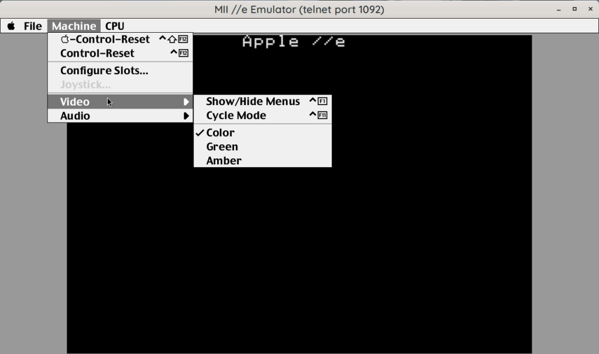
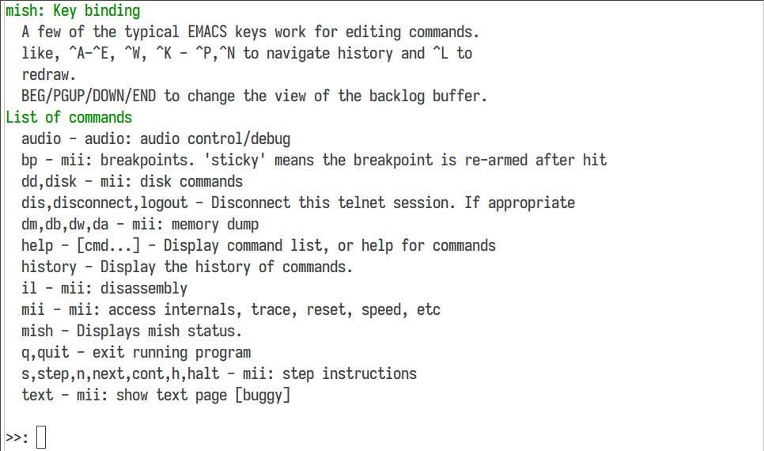

   

# MII Apple //e Emulator

*Note:* New versions and Changelog are at [CHANGELOG.md](CHANGELOG.md)

*Note2:* UI Library has moved to [libmui](https://github.com/buserror/libmui)

I know there are many out there, but none of them were ticking my fancy, so I decide to write my own. To start with it was "How hard can it be really?" then it snowballed as more and more things were fixed & added. It's been shelved for a while because well, it lacked documentation, headers, licence and stuff, so I spent some time cleaning it up for release.

One primary reason for this project was that linapple (or -pie) codebase is really horrible. It dates back from 2000's or before, with loads of Windows crud leftover, some SDL crud added, the audio just doesn't really work, and overall if you want to hack around the codebase, it's pretty dreadful.

   
   <i>Quick Howto Load & Boot</i>

I wanted something:

* Modern, Clean code, modular -- in the spirit of simavr, usable as a library.
* Made for linux. In C. With a Makefile. None of the trendy bloatware.
* Small, Fast.
* Minimal dependencies.
* No gigantic config file.
* I didn't need II+ or unenhanced IIe, just 65c02 //e.

   
   <i>Double hires in color</i>

## What can it do?
 * 65c02 //e with 128K of ram (RAM exensible to 2MB).
 * Support all known graphic modes:
    * Double-hires in mono and color, with automatic switch
    * All the other modes in color/mono
    * Color (NTSC/RGB), Green, Amber rendering
    * Simulated 'scanlines' & artifacts to make it look vintage
 * Speaker audio. ALSA For playback.
    * Adds a small 'attack' filter when playing back to soften the often annoying 'click' of typical audio effects from the apple II.
 * Mouse Card -- mouse isn't captured like in some other emulators.
 * Super Serial Card -- can open a /dev/tty device, or a 'loopback' device.
 * No Slot Clock
 * Joystick Support
 * Smartport DMA 'hard drive' card
 * RAMWorks III card, with 1MB of RAM
 * "Titan Accelerator //e" simulation, to turn on/off fast mode.
 * Terence's J Boldt [1MB ROM card](https://github.com/tjboldt/ProDOS-ROM-Drive), also because I own a couple!
 * Floppy Drive with **WOZ v1/v2**, **NIB** and **DSK** (all with read&write).
 * No dependencies (X11) OpenGL rendering
 * Built-in debugger (using telnet access)
 * Super cool looking UI!
 * Unique, and accurate view of the spinning floppies!
 

  

<i>Poor quality gif, It is a LOT smoother at 60fps in the program!</i>

## How to I compile it and run it?

   
   <i>Good old green monitor style. Theres Amber too.</i>

   * You need a C compiler, make, and a few libraries:
      * libasound2-dev [ optional, for audio ]
      * libgl-dev
      * libglu-dev
      * libx11-dev
      * libpixman-1-dev
      * pkg-config
   * Many of them will probably be installed already.
   * For more details on development, see [Compiling](docs/Compiling.md)
   * Then just type `make` and it should compile.
   * To run it, just type `build-x86_64-linux-gnu/bin/mii_emu_gl` and it should start.
   * If you want to install it, I suggest 'make avail' this will install a symlink into /usr/local/bin pointing back to the source tree, so you can run it from anywhere.

## Command line options
If you run it with no options, and there are no config file, it will present
you with a dialog to select the Cards and the disk images.

   
   <i>Main slot configuration dialog</i>

You can also use the command line to specify them, and other options.

   * `mii_emu_gl --help` will display:

         Usage: ./build-x86_64-linux-gnu/bin/mii_emu_gl [options]
         Options:
            -h, --help              This help
            -v, --verbose           Verbose output
            -fs, --full-screen      Start in full screen mode
            --hide-ui, --no-ui	   Hide the UI
            --list-drivers          List available drivers, exit
            --list-roms             List available ROMs, exit
            --video-rom <name>      Load a video ROM
            -m, --mute              Start with audio muted
            -vol, --volume <volume> Set speaker volume (0.0 to 10.0)
            --audio-off, --no-audio, --silent	Disable audio output
            -speed, --speed <speed>	Set the CPU speed in MHz
            -s, --slot <slot>:<driver> Specify a slot and driver
                  Slot id is 1..7
            -d, --drive <slot>:<drive>:<filename>	Load a drive
                  Slot id is 1..7, drive is 1..2
                  Alternate syntax: <slot>:<drive> <filename>
            -def, --default         Use a set of default cards:
                  Slot 4: mouse
                  Slot 6: disk2
                  Slot 7: smartport
            -nsc[=0|1]              Enable/Disable No Slot Clock:
                  0: disable
                  1: enable [Enabled by default]
            -titan[=0|1]            Enable/Disable Titan Accelerator IIe:
                  0: disable [default]
                  1: enable [Start at 3.58MHz]

     And the available drivers:

         $ ./build-x86_64-linux-gnu/bin/mii_emu -L
            mii: available drivers:
                titan - Titan Accelerator IIe
                  ssc - Super Serial card
            smartport - SmartPort card
                  nsc - No Slot Clock
                mouse - Mouse card
               eecard - EEPROM 1MB card
                disk2 - Apple Disk ][

## Key Bindings
There are just a few keys that are mapped for anything useful. List is not exausive, but here are the main ones:
   * **Control-F12** is Control-Reset on the IIe. (**Shift-Control-F12** is **Open Apple-Reset**)
   * **'Super'** left and **'Super'** right are **Open** and **Close Apple** keys.
      These keys are mapped to the left and right 'Windows' keys on a PC keyboard, and they might want to open the start menu (I know it's the case with Cinnamon), so you might want to disable that.
   * **F5** sets the CPU speed to 1MHz
   * **F6** to 4MHz.
   * These keys control the built-in debugger:
      * **Control-F4** Stops the emulator; see the command prompt/telnet for how to proceed, dump state, disassembly etc.
      * **Control-F5** is 'continue' -- resumes the emulator.
      * **Control-F6** 'steps' the emulator, ie one instruction at a time.
      * **Control-F7** 'next' instruction, ie step over a JSR instruction.

  
   <i>The built-in shell, telnet into the emulator!</i>

## Anything else?
 * Well it has it's own command line shell, using my own [libmish](https://github.com/buserror/libmish) so there's loads you can do by... *telnet into* the emulator!
 * Yes, you can telnet into the running emulator!
   + The telnet port is displayed in the window title bar.
   + The port is 'semi random' -- it tries to find one that is derivative of the program name, but it will try several until it finds one that is free.
 * It has it's own debugger shell. You can:
    + Add break/watch points.
    + Step, Next (jump over JSR's), Continue, Halt
    + Has a 16 instruction trace history when hitting a breakpoint.
    + Dump memory map
    + Trigger soft switches
    + Disassemble
 * Also MII comes with it's own mini-assembler, used to compile some driver and the CPU unit tests (inspired by apple2ts, see bellow)
 * It embeds all the files it needs, ROMs, fonts etc so you don't need to install it, just run it, it'll work.
 * MII "Hard Disk" uses 'overlay' files:
     + This writes blocks on a /separate/ (sparse) file from the main file.
     + This "Overlay" is created automatically and allows you to keep your image files clean, unless you want to 'commit' your overlay back in.
     + This allows you to make sure your disk images aren't corrupted when 'hard rebooting' the emulator, if you are in the process of testing/developing a program for example.

## What it cannot do
 * A2Desktop PT3 player doesn't see keypresses.
 * That's about it really, all the other things I tried work
 * Joystick support is a bit limited, no 'mapping' I used a (USB) 8bitdo NES30 Pro, and it works, but it's not perfect. But, I can play choplifter with it, so it's good enough for now... *NOTE* Soon will have it's own config dialog to do mapping.

## What it could do with
 * The main window is 1280x720 on purpose, so it could do Full Screen.
 * ~~Port it to Raspbery Pi~~. This was reported to work on a raspi 5.
 * Make a tool to 'flatten' overlay files back into the primary image.
 * Make a UI for the debugger, instead of telnet.
 * A mockingbird sound card emulation [In Progress].

  

<i>Obligatory View of Total Replay</i>

## Inspiration, Licence etc
 * MIT Licence, I think this is the most permissive, and this work is a derivative and has a lot of inpsiration from too many projects to claim anything more restrictive.
 * The CPU Emulation was inspired by a few other implementations:
    * [Chips](https://github.com/floooh/chips) -- which I used for a little while, but it was a pain to add the 65c02 instructions, and it had stuff I didn't want/need like 6510 emulation.
    * [Apple2ts](https://github.com/ct6502/apple2ts/) -- In fact I converted a few bits from there; and I got the idea for the built-in assember from there, and some of the unit tests, AND the Smartport driver emulation idea!
 * Other bits were inspired by:
    * [bobbin](https://github.com/micahcowan/bobbin) which is newish as well, and is great for text mode, but I didn't like the fact its' all globals etc. I still borrowed the Floppy emulation from there, until I get around to do one.
    * [isapple2](https://github.com/ivanizag/izapple2/) for other bits and pieces.
    * [clemens_IIgs](https://github.com/samkusin/clemens_iigs) for the mockingboard code -- not working just yet.
 * And of course, countless books, articles and posts read over the last 40 years!

