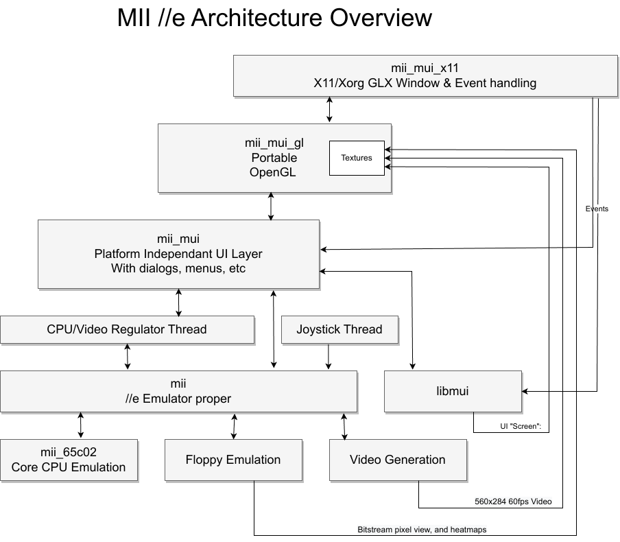

## Top down view

<center>
   
   <i>Here how it's supposed to work!</i>
</center>

The emulator was made to be portable on most things. It's plain C compiled with -Wextras, I run in regularly thru the static analyser, and I regulartly check it with valgrind. So it's pretty clean.

It evolved from the original mess, and I organized it into bits which would make porting it to other platform easier.


## How to I compile it and run it?
   * You need a C compiler, make, and a few libraries:
      * libasound2-dev [ optional, for audio ]
      * libgl-dev
      * libglu-dev
      * libx11-dev
      * pkg-config
   * Many of them will probably be installed already if you regulargly compile stuff.
   * Then just type `make` and it should compile.
   * To run it, just type `build-x86_64-linux-gnu/bin/mii_emu` and it should start.

### WSL
MII Is reported to work on WSL, but I haven't tested it myself. You will need to install the X11 server for Windows, and set the DISPLAY variable to the correct value. I'm sure there are tutorials on the internet on how to do that.
Also:
   * sudo apt install libasound2-plugins
   * nano ~/.asoundrc, and add these two lines:

```
pcm.default pulse
ctl.default pulse
```


   * Restart WSL


## Development
* This is the first project I made using vscode as my main IDE; I used Eclipse for many years as the indexer was pretty much unbeatable (still is).
* To support vscode I needed some tooling to create the '*compile_commands.json*' file, which is used by the C/C++ extension to provide intellisense. So to create that file, you use `make lsp` and it will create the file in the project directory.
* Another thing vscode sucks at is Makefiles (despite the extension, building is painful and next to useless). So there is a target called `make watch` that you can run in a separate terminal to auto-build as soon as you save any files in vscode. That is when you realize for example that vscode re-save the file anytime you press control-S, regardless of wether the file has changed or not. So you end up with a lot of unnecessary builds. I'm sure there is a way to fix that, but I haven't found it yet.

## Code Style
I have pretty consistent code style across my projects.
* tabs=4. Just because.
* 80 columns lines or so. I don't like to scroll horizontally and I like splitting my screen vertically. (also see, tabs=4!).
* K&R style exclusively. None of that Allman/GNU horribleness.
* GNU99 Dialect.
* No Yoda, we are no longer in 1975. `if (0 == foo)` is just stupid.
* I use "!!" to convert to 1 or zero from an expression. I call it the 'normalisation operator'. it is not commonly seen, apart from places like the Linux kernel.
* I use *minipt.h* for protothreads. I like protothreads, and when you are aware of their limitations, they are a great tool. They are used for the video rendering, the no-slot-clock etc.

## What needs doing?
* I'm sure there are bugs. I haven't tested it on a lot of hardware, and apart from quite a few games and a few known productivity app, it had had very little extensive testing. So testing!
* In the code there are a few bits which needs fixing
   * The floppy driver still has issues writing, most notably it fails to 'bit copy' stuff when using Copy II plus. It's a timing issue, but I haven't found it yet.

